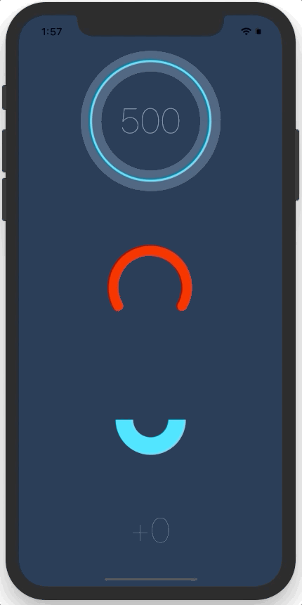

# react-native-circular-progress

React Native component for creating animated, circular progress with ReactART. Useful for displaying users points for example.

## Example app


## Installation

1. Install library `npm i --save react-native-circular-progress`
2. Link ART library to your ReactNative project ([how to link a library?](https://facebook.github.io/react-native/docs/linking-libraries-ios.html#content)). You'll find ReactART library in `node_modules/react-native/Libraries/ART/ART.xcodeproj`

## Usage

Import CircularProgress or AnimatedCircularProgress.

```js
import { AnimatedCircularProgress } from 'react-native-circular-progress';
```

Use as follows:

```jsx
<AnimatedCircularProgress
  size={120}
  width={15}
  fill={100}
  tintColor="#00e0ff"
  backgroundColor="#3d5875" />
```

You can also define a function, that'll receive current progress and for example display it inside the circle:

```jsx
<AnimatedCircularProgress
  size={200}
  width={3}
  fill={this.state.fill}
  tintColor="#00e0ff"
  backgroundColor="#3d5875">
  {
    (fill) => (
      <Text style={styles.points}>
        { this.state.fill }
      </Text>
    )
  }
</AnimatedCircularProgress>
```

Finally, you can manually trigger a duration-based timing animation by putting a ref on the component and calling the `performLinearAnimation(toValue, duration)` function like so:
```jsx
<AnimatedCircularProgress
  ref='circularProgress'
  ...
/>
```
```javascript
this.refs.circularProgress.performLinearAnimation(100, 8000); // Will fill the progress bar linearly in 8 seconds
```

## Configuration

You can configure the passing by following props:

- **size** – width and height of the circle
- **width** - thickness of the line
- **fill** - current, percentage fill (from 0 to 100)
- **prefill** - percentage fill before the animation (from 0 to 100)
- **tintColor** - color of a progress line
- **backgroundColor** - color of a background for progress line
- **rotation** - by default, progress starts from the angle = 90⦝, you can change it by setting value from -360 to 360
- **tension** - the tension value for the spring animation (see [here](https://facebook.github.io/react-native/docs/animations.html#core-api))
- **friction** - the friction value for the spring animation (see [here](https://facebook.github.io/react-native/docs/animations.html#core-api))
- **children(fill)** - you can pass function as a child to receive current fill


## Working example app

You can find working example in the `example` directory of this repository. You can run it by:

```sh
git clone https://github.com/bgryszko/react-native-circular-progress.git
cd  react-native-circular-progress/example/ProgressChart
npm install
open ios/ProgressChart.xcodeproj
```
XCode will open. Click Run button and that's it.


## License

MIT


## Special thanks
Special thanks to [Chalk+Chisel](http://chalkchisel.com) for creating working environment where people grow. This component was created for one of the projects we're working on.
