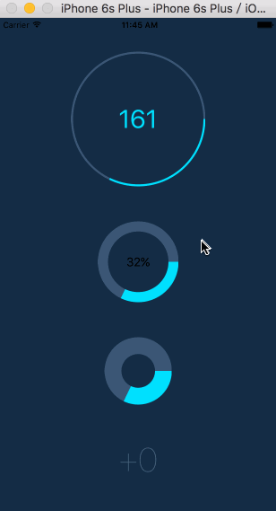

[]()
[](https://www.npmjs.com/package/react-native-circular-progress)
[](https://www.npmjs.com/package/react-native-circular-progress)

# react-native-circular-progress

React Native component for creating animated, circular progress. Useful for displaying users points for example. **Works on iOS & Android.**

## Example app


## Installation

`npm i --save react-native-circular-progress`

## Usage

Import CircularProgress or AnimatedCircularProgress:

```js
import { AnimatedCircularProgress } from 'react-native-circular-progress';
```

Use as follows:

```jsx
<AnimatedCircularProgress
  size={120}
  width={15}
  fill={100}
  tintColor="#00e0ff"
  onAnimationComplete={() => console.log('onAnimationComplete')}
  backgroundColor="#3d5875" />
```

You can also define a function, that'll receive current progress and for example display it inside the circle:

```jsx
<AnimatedCircularProgress
  size={200}
  width={3}
  fill={this.state.fill}
  tintColor="#00e0ff"
  backgroundColor="#3d5875">
  {
    (fill) => (
      <Text style={styles.points}>
        { this.state.fill }
      </Text>
    )
  }
</AnimatedCircularProgress>
```

Finally, you can manually trigger a duration-based timing animation by putting a ref on the component and calling the `animate(toValue, duration, easing)` function like so:
```jsx
<AnimatedCircularProgress
  ref={(ref) => this.circularProgress = ref}
  ...
/>
```
```javascript
this.circularProgress.animate(100, 8000, Easing.quad); // Will fill the progress bar linearly in 8 seconds
```

The `animate`-function returns the timing animation so you can chain, run in parallel etc.

## Configuration

You can configure the passing by following props:

- **size** – width and height of the circle - could be `number` or `object` if you use `Aniamted.Value()`
- **width** - thickness of the lines
- **backgroundWidth** - thickness of the background line
- **fill** - current, percentage fill (from 0 to 100)
- **prefill** - percentage fill before the animation (from 0 to 100)
- **tintColor** - color of the progress line
- **backgroundColor** - color of the background for the progress line. If unspecified, no background will be rendered
- **rotation** - by default, progress starts from the angle = 90⦝, you can change it by setting value from -360 to 360
- **duration** - duration of the animation
- **easing** - animation easing function
- **lineCap** - the shape to be used at the ends of the circle. Possible values: butt (default), round or square. (see [here](https://developer.mozilla.org/en/docs/Web/SVG/Attribute/stroke-linecap))
- **arcSweepAngle** - the angle that you want your arc to sweep in the case where you don't want a full circle. Default is 360.
- **children(fill)** - you can pass function as a child to receive current fill
- **onAnimationComplete** - you can pass a callback function that will be invoked when animation  completes. (see [here](https://facebook.github.io/react-native/docs/animated.html#working-with-animations))

## Running example app

```sh
git clone https://github.com/bgryszko/react-native-circular-progress.git
cd  react-native-circular-progress/example
yarn
yarn start
```

## Author

Bartosz Gryszko (b@gryszko.com)

## License

MIT

## Special thanks
Special thanks to [Chalk+Chisel](http://chalkchisel.com) for creating working environment where people grow. This component was created for one of the projects we're working on.
